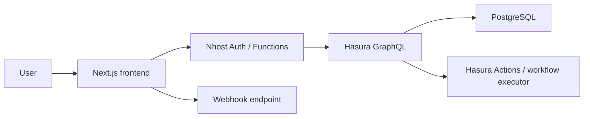

# Architecture Overview

The AI Agent Workflow Builder is structured as a Next.js front end connected to an Nhost + Hasura + PostgreSQL backend for multi-tenant workflow execution. The repository now includes backend scaffolding for the intended production stack, while the existing UI remains intact and is still backed by the demo state until real credentials are configured.

## System architecture

## Database architecture

The production schema is defined in [docs/database-schema.sql](database-schema.sql) and contains organization-scoped tables for organizations, members, workflows, workflow steps, triggers, workflow runs, and step runs. These tables are designed to support role-based access and per-organization isolation in Hasura.

## Authentication and authorization

Authentication should be handled through Nhost Auth in production. The frontend currently still uses the demo store for local development, but the repository now includes backend configuration helpers and a Hasura-ready contract for migrating to real auth and permissions.

## Workflow execution

Workflows execute sequentially by position. The planned execution path is: authenticate user → verify organization access → check quota → create run → evaluate steps → create/update step runs → pause at approval → resume after approval.

## Real-time updates

The intended production architecture uses Hasura GraphQL subscriptions over workflow_runs and step_runs. Repository scaffolding now includes a subscription query template in [lib/graphql/operations.ts](../lib/graphql/operations.ts) for that transition.

## Quota enforcement

Quota is represented in the dashboard UI and the backend scaffolding now includes server-side helper modules for quota evaluation. The actual enforcement layer still depends on live Nhost/Hasura credentials and backend actions.

## Deployment architecture

The application is designed for deployment on Vercel or another Next.js-friendly platform. Production configuration should provide Nhost environment variables and Hasura GraphQL endpoints, and the backend should be provisioned through Nhost/Hasura rather than the browser demo store.
